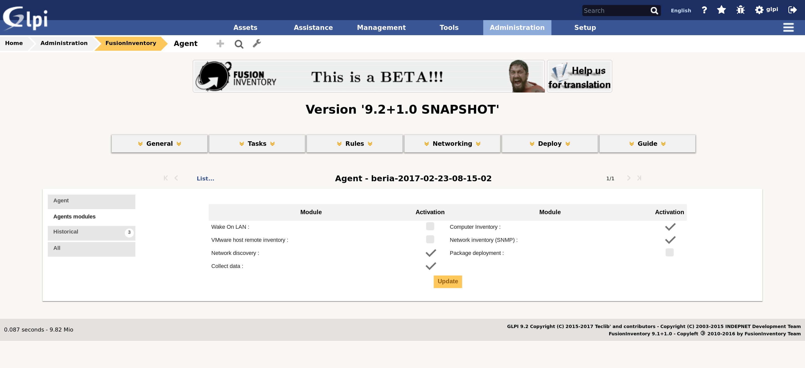
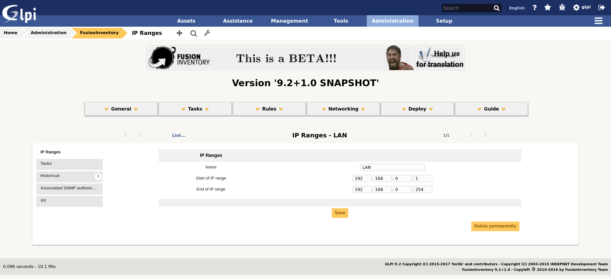
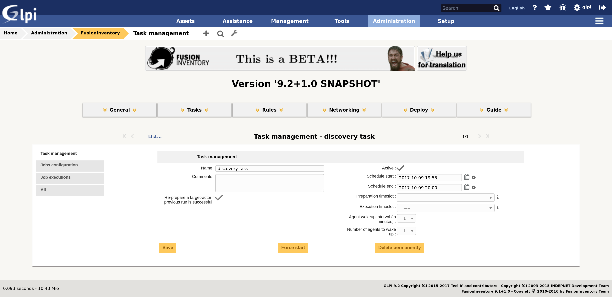
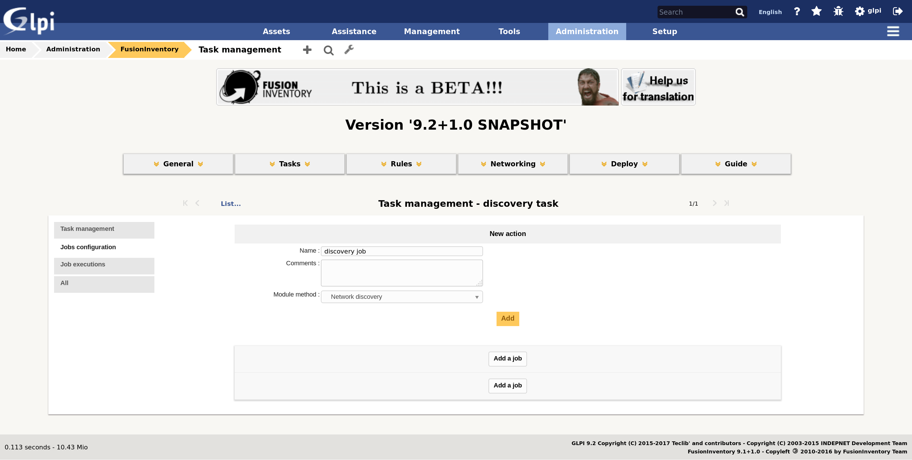
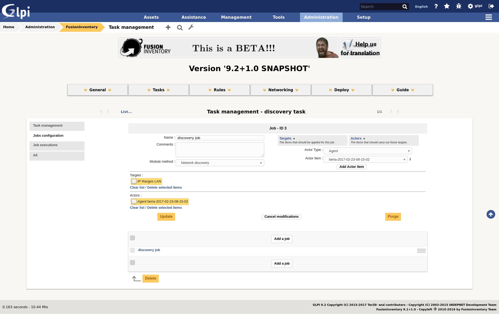

# Network discovery

## Purpose

A network discovery task aims to scan the the network, and reports devices
found to the GLPI server, so they can be added to the list of known assets.

Once part of the list of known assets, further information can be retrieved
from SNMP-enabled devices using a [network inventory
task](networkinventory.md).

## Overview

This task uses the following protocols to scan IP networks:

* ICMP scan (since v2.4.1, if `Net::Ping` is available, try first ICMP Echo and then ICMP TimeStamp)
* NetBIOS scan (if `Net::NBName` is available, and proper credits provided)
* SNMP scan (if `Net::SNMP` is available, and proper credits provided)

Any device replying to at least one of those protocols will be *discovered*,
with minimal information, such as mac address and hostname.

Additionaly, if the device replies to SNMP, the agent will attempt to identify
it, using various methods:

* The primary method relies on retrieving the value of
the dedicated SNMP variable (`SNMPv2-MIB::sysObjectID.0`), wich is a
constructor-specific OID identifying a given device model, and comparing it to
the agent internal database (the `sysobject.ids` file, described in [agent
database](../ FusionInventory_agent/ Advanced/database.md)). If a match is found, `model`, `type` and
`manufacturer` are added to the information reported to the GLPI server, allowing
simple identification.
* If no match is found, various heuristics are performed
in order to identify the device, with lower reliability.

Discovered devices are then reported to the GLPI servers, and [import
rules](../fi4g/importrules.html) are applied. Devices not matching any import
criteria will be kept in a server list of ignored devices.

## Running

### Pre-requisite

The agent performing the task needs to have the network discovery module
installed. Many Linux distributions ships agent modules in distinct packages,
to reduce the burden of dependencies. And the module itself has multiple
additional optional software dependencies, as noted earlier.

The agent performing the task needs network access the target networks, with
forementioned protocols, as well as control access, for SNMP: just being able
to send UDP packets to a device is not enough, if this device is configured to
ignore them.

As for any other server-controled task, the agent should use either managed or
half-managed mode, as explained in [agent usage](../ FusionInventory_agent/  Configuration/usage.md). If
the task is server-triggered, the agent must run in managed mode, and
its HTTP port should be reachable from the server.

### Server execution

#### Module activation

In order to assign a network discovery task to an agent, the network discovery
module needs first to be activated for this agent, as this is not the default.

##### Multiple agents

1. from the FusionInventory plugin welcome screen, select the _General_ >
  _General configuration_ menu item
1. select the _Agents modules_ tab

You can then either activate the module for any number of agents, and even
configure it to be activated by default, as illustrated by the following
screenshot.


##### Single agent

1. from the FusionInventory plugin welcome screen, select the _General_ >
  _Agents management_ menu item
1. select the specific agent in the list
1. select the _Agents modules_ tab

You can then activate the network discovery module for this agent, as
illustrated by the following screenshot.



#### Target network creation

You now have to define an IP range item, corresponding to the the network to be
scanned:

1. from the FusionInventory plugin welcome screen, select the _Networking_ > _IP
ranges_ menu item

You can then create a new item, as illustrated by the following screenshot.



If you want to associate SNMP credentials to this network, for probing SNMP
devices during discovery, you have to use the _Associated SNMP authentication_
tab. Warning: each associated credential implies one additional authentication
attempt, and another network timeout penalty if not successful. See
[Efficiency concerns](#efficiency-concerns) for details.

#### Task creation

You now have to define a task, including a network discovery type job:

1. from the FusionInventory plugin welcome screen, select the _Tasks_ > _Task
   management_ menu item
1. create a new task, with an arbitrary name (for instance, discovery task), in
   active state, and save it

1. select _Jobs configuration_ tab
1. create a new job, with an arbitrary name (for instance, discovery job),
   using network discovery as module method, and save it

1. configure this job by assigning it a target (the IP range item create
   previously) and an actor (the elected agent), and update the current
   configuration


#### Results analysis

Devices matching import rules should be immediatly added to the list of known
assets. Others are kept in a list of ignored devices, where they can be
manually reviewed and imported if suitable:

1. from the FusionInventory plugin welcome screen, select the _Rules_ >
   _Ignored import device_ menu item

### Command-line execution

A network discovery task can be also performed without a GLPI server, allowing
easier control and troubleshooting, with the
[fusioninventory-netdiscovery](../ FusionInventory_agent/ Manpage/fusioninventory-netdiscovery.md)
command-line tools. However, there is no way currently to inject the result
in GLPI.

### Efficiency concerns

#### Credentials

Unfortunatly, there is no way to distinguish a failed SNMP authentication
attempt on a device, from the absence of a device. It means the agent will try
each available credentials against each IP address, in given order, and wait
for timeout each time. The most efficient way to adress this issue if to only
use the relevant set of credentials, and reduce the specific SNMP timeout.

#### Threads number

In order to scan multiple addresses simultaneously, the agent can use multiple
discovery threads. This allow multiple simultaneous request, but also increase
resource usage on agent host. And also increase crash probability, if TLS is
used in any manner (including agent/server communication through HTTPS), as
perl TLS bindings are not 100% thread-safe. Unfortunatly, there is no way
currently to avoid thread usage totally, as current implementation always use
one controlling threads, in addition to a configurable number of working
threads.

## Troubleshooting

### The task doesn't run at all

The agent may be lacking the Net Discovery module: run `fusioninventory-agent
--list-tasks` to check.

There may be a server/agent communication issue: check you can reach the agent
port (62354 by default) from the server host.

The agent may be ignoring server requests, due to a a trust issue: check the
agent logs for "[http server] invalid request (untrusted address)" message.

### The task runs, but agent logs show than SNMP is not used

The agent may be lacking the required Net::SNMP perl module: run `perl
-MNet::SNMP` on agent host to check, it should blocks.

There may be no SNMP credentials associated to the network scanned, check your
IP range definition on server side (_Networking_ > _IP Ranges_ menu item).

### The task runs, but no devices get added to my inventory

The reported items are unsufficiently identified to be imported, according to
your current import rules, check the list of ignored devices (_Rules_ >
_Ignored import device_ menu item) and the list of import rules (_Rules_ >
_Equipment import and link rules_ menu item) on server side.

### The task runs, but my SNMP devices are not properly identified

The agent probably lacks the device SNMP identifier in its internal database.
Use fusioninventory-netdiscovery executable with debug option on the device,
get the value from its output, and add it to the sysobject.ids file, as
described in [agent database](../ FusionInventory_agent/ Advanced/database.md) to fix the issue.

``` shell
$> fusioninventory-netdiscovery --first 192.168.0.1 --last 192.168.0.1 --credentials version:2c,community:public --debug
..
[debug] partial match for sysobjectID .1.3.6.1.4.1.311.1.1.3.1.1 in database: unknown device ID
```

### The agent crashes

This is likely to be a TLS multithreading issue. They are multiple ways to
reduce the probability of such crash:
* make sure you only have one TLS perl stack installed on the agent host,
  preferably IO::Socket::SSL + Net::SSLeay. Having both stacks at once 
  (IO::Socket::SSL + Net::SSLeay vs Net::SSL + Crypt::SSLeay) usually leads to
  unexpected results, even without thread usage
* use latest upstream release of IO::Socket::SSL, even if your distribution
  doesn't provide it
* reduce threads number during network discovery tasks

However, the only actual solution currently is to disable SSL completly, using
plain HTTP for agent/server communication. If the agent run on server host,
that's usually not really a problem.
