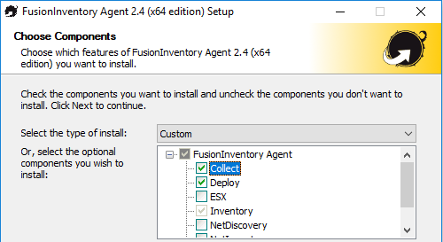
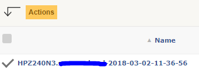
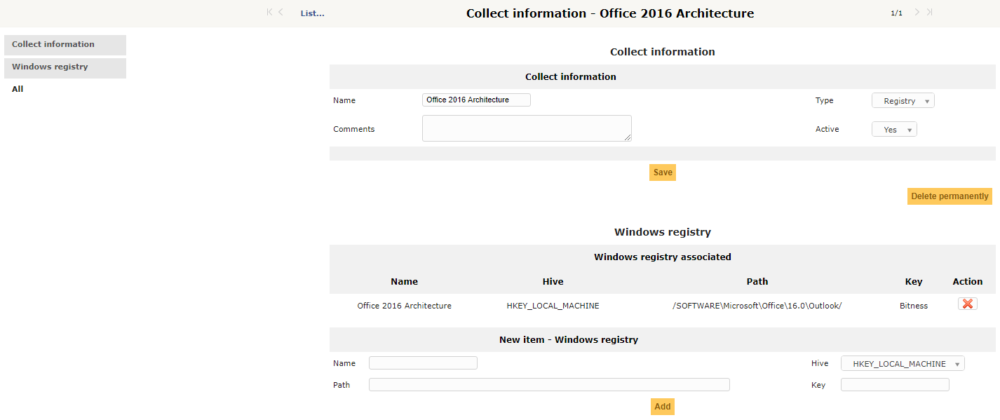
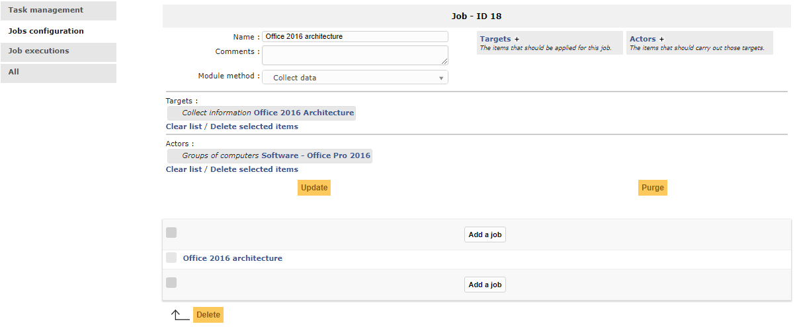
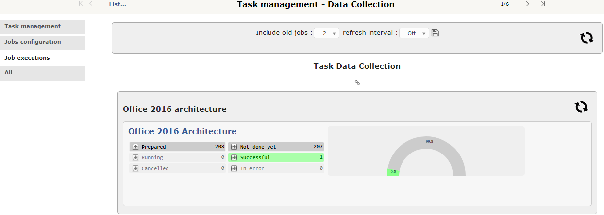

# Collect Task

## Purpose

The purpose of Collect task is simply to collect data not provided by Inventory task. You can collect file list with criteria, registry value or WMI value on windows systems.

## Overview

In this example, we will show you how to retrieve a piece of information out of the Windows Registry. The process is the same for WMI query or file query.

The goal here is to retrieve the architecture of Office 2016. Is it 32 or 64 bit? To know it, we are going to retrieve the  HKEY_LOCAL_MACHINE\SOFTWARE\Microsoft\Office\16.0\Outlook\Bitness value.

## Running

### Pre-Requisites

#### Agent Module installation

Before you can use the "Collect Data" module, your agent needs to be configured to allow it.

On Windows, select the "Collect" component while you setup the agent.

On Linux, the agent module should be installed by default if you used the GIT packages to install the agent.

#### Agent Module activation

_In FusionInventory for GLPI, we need to enable the "Collect" module of your agent._

Go to the GLPI "Administration" tab and select "FusionInventory".

In FusionInventory, under the "General" menu, select "Agents Management".

Select the agent(s) you want to manage and click "Actions"

Select the action "Module - Collect" and "Yes". Click "Post".

If you want, you can also make it the default value. To do so, in FusionInventory, under the "General" menu, select "General Setup".

Go to the "Agent Module" menu, scroll down to the Collect data" module, tik the "Activation (by default)" and "Update"

#### Collect definition

In FusionInventory, under the "Tasks" menu, select "Computer Informations".

Add a collect information.

Under the "Windows Registry" menu, add the Windows registry key you want to collect.

You end up with this.

#### Dynamic group configuration

The easyest way to select a group of computer based on a criteria is to create a "Group a Computers". Two types of groups exist. Dynamic and Static.

In this case, we are going to use a Dynamic Computer Group.

In FusionInventory, under the "General" menu, select "Groups of Computers".

Add a new group. Select the type "Dynamic".

Go back to your Group, go to the criteria menu and add a "Global Search Criterion" (the white background +).

Add the information about the software you search and Save.

### Task creation

We now have 
- the thing we want to retrieve (a Registry value)
- The group where we want to retrieve the thing (the group of computers)
- The way to retrieve the thing we want (agent config)

Let's create the task that will retrieve the information we need.

In FusionInventory, under the "Task" menu, select "Task Management".

Add a new task, enable it and select a preparation and a running time slot.

Add a new job, select the Module Method "Collect Data"

Open it and add the target and Actor we just created. 

The target is the thing we want to retrieve.

The Actor is the Group of Computers where we want to retrive the information. Let's not forget that this is a "Push" job. The agent will collect data on himself to push it to the server. The actor is the agent itself.

Update to save your changes.

### Result

As soon as the first agent run, is push the information to the server. The running progress is displayed like this

If we look at the computer that just pushed the information we wanted, we will now have a new menu entry.

We have an Office 2016 Professional x86 edition (which means 32bit).

